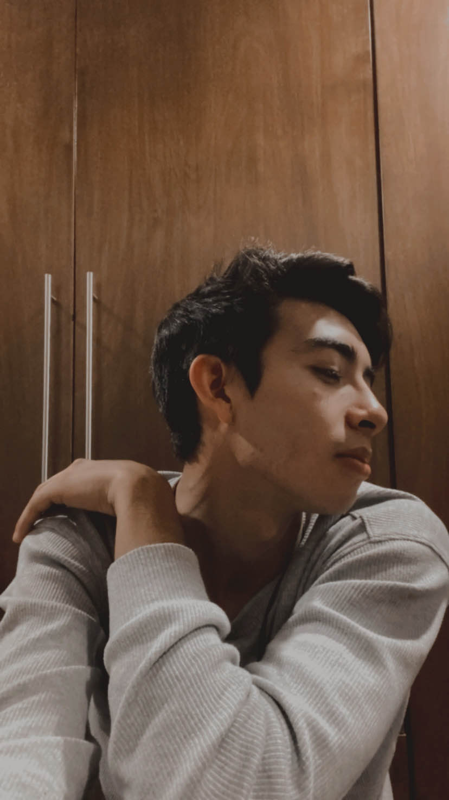

# Integrantes de la Asignatura Programación en Lenguajes Interpretados.

## Profesor

### Jonathan MirCha

Hola soy tu amigo y docente digital...

- [jmiranda@amerike.edu.mx](jmiranda@amerike.edu.mx)
- [Perfil de _GitHub_](https://github.com/jonmircha)

---

## Estudiantes

### Juan Manuel Ulloa Chiñas
 Soy estudiante de amerike, jugador de volley, arquero, violinista, arista
 - [cdmx2408@amerike.edu.mx](cdmx2408@amerike.edu.mx)
 - [SonocJM](https://github.com/SonocJM)
 
 --