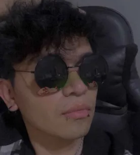

# Integrantes de la Asignatura Programación en Lenguajes Interpretados.

## Profesor

### Jonathan MirCha

Hola soy tu amigo y docente digital...

- [jmiranda@amerike.edu.mx](jmiranda@amerike.edu.mx)
- [Perfil de _GitHub_](https://github.com/jonmircha)

---

## Estudiantes
Jorge Barrera Dorantes

soy Jorge Barrera y soy jugador de lol me distraigo muy facil pero intento ser buena persona dia tras dia me caen bien todos
[cmdx2757@amerike.edu.mx](cmdx2757@amerike.edu.mx)
[Temps91](https://github.com/Temps91)
