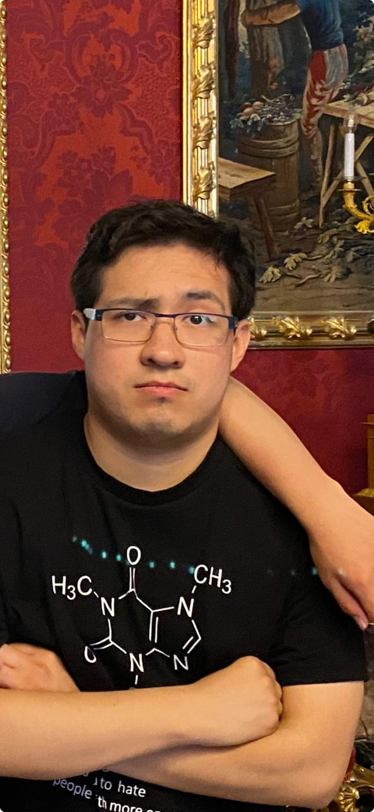

# Integrantes de la Asignatura Programación en Lenguajes Interpretados.

## Profesor

### Jonathan MirCha

Hola soy tu amigo y docente digital...

- [jmiranda@amerike.edu.mx](jmiranda@amerike.edu.mx)
- [Perfil de _GitHub_](https://github.com/jonmircha)

---

## Estudiantes

### Francisco Javier González Hernández

Un estudiante que le gustaria aprender un poco más de la programación y fanatico de los videojuegos.

- [cdmx2781@amerike.edu.mx](cdmx2781@amerike.edu.mx)
- [FlanVessel](https://github.com/FlanVessel)

---